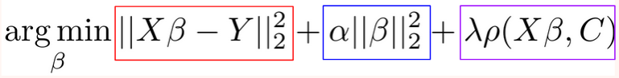

# About CoIR

The CoIR algorithm considers a target dataset with labeled and unlabeled samples acquired from one or more source datasets, where the objective learning task is to predict the brain conditions of unlabeled target samples (peer-reviewed publication out soon!). 

Both the target and source experiments must have the same brain conditions to classify. To classify the conditions, the framework optimizes three objectives:
- minimizing empirical error on labeled data
- minimizing dependence on domain covariates
- minimizing model complexity (i.e., reduce the upper bound of generalization risk). 

<b>Fig. 4 - The CoIR algorithm uses the regularized least squares classifier, a linear model which has 3 goals to minimize penalty. The red box minimizes the prediction error on the training set, the blue box minimizings the magnitude of model weights, and the purple box minimizings the dependence between the neural data and the covariate matrix C. The covariate matrix is a binary matrix with a row for each item and column for each participant and study to relate the examples to the subjects. The goal of the purple section is to shrink the weights on neural features that allow a prediction of which participant an example belongs to. </b>

The classifiers can be viewed as feature mapping where samples of all domains are in the same distribution and project the input features to a one-dimensional output space, regularizing the hypothesis space to reduce model complexity. Additionally, the algorithm minimizes empirical error on labeled data and domain dependence on domain covariates further reducing model complexity. Minimalizing the prediction/empirical error and the domain dependence occurs in the framework simultaneously, so can therefore be viewed as combining the benefits of domain-invariant classifier methods and domain dependence minimization mapping.

The CoIRLS algorithm uses the regularized least squares classifier, considering unique experiment-subject combinations by encoding a matrix of experiment designs and subjects as domain covariates for domain adaptation, called one-hot encoding. The output is a one-dimensional space of model weights for the classification task at hand, which can be used to identify the top 1% coefficients (in magnitude) to in turn visualize the brain areas of positive and negative activation for interpretation. 