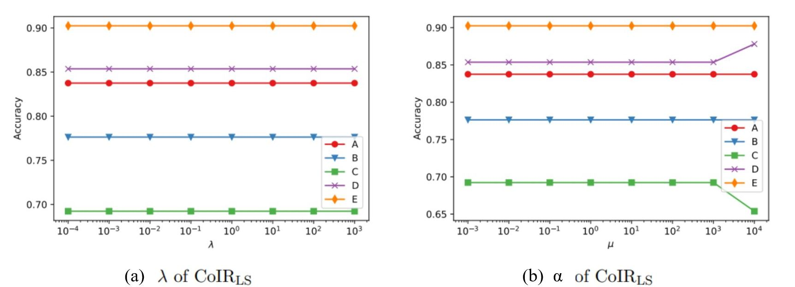

## CoIRLS

The CoIRLS framework is completed in 4 steps: 1) encode domain covariates with one-hot encoding; 2) construct the identity matrix, centering matrix, probability matrix, and a matrix denoting unlabeled target data as 0s; 3) construct kernel matrix and linear kernel; and 4) compute and return the classifier based feature mapping. 

### Input
Inputs required include: 1) data matrix of source and target data; 2) vector of training labels; and 3) domain covariates.

### Hyper-Parameters
Hyper-parameters (i.e., values that control the model’s learning process) include: 1) mean (i.e., μ1 and μ2); and 2) kernel function and corresponding hyper-parameters. Optimal hyper-parameters can be found using leave-one-domain-out cross validation on source domain data. 
The algorithm is not sensitive to the trade-off parameter, indicating the covariate-independence regularization importance stability (see Fig. 4 c). This algorithm is also not sensitive to the mean, though larger values greater than 10,000 can lead to a change in performance (see Fig. 4 d). 

